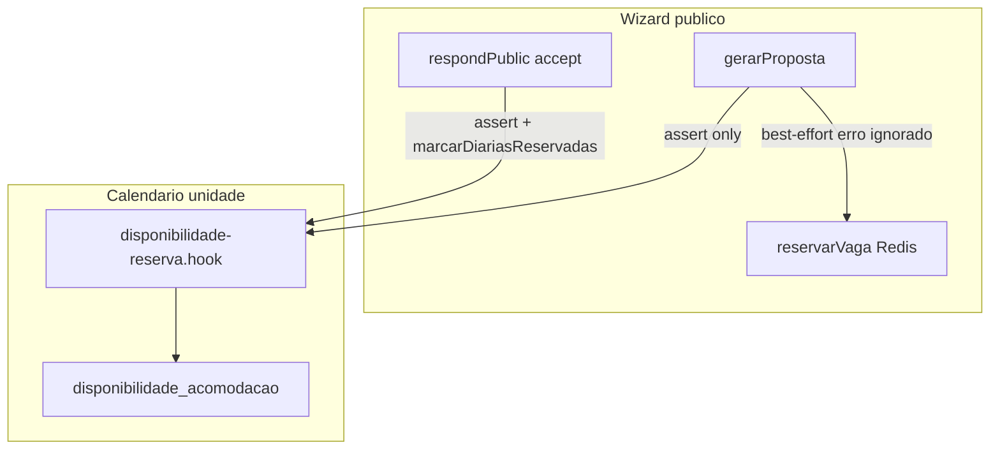
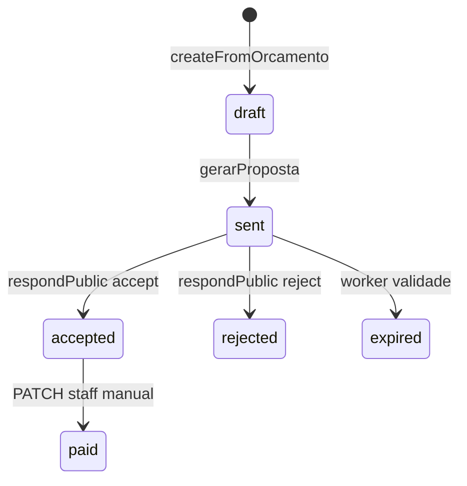

# Módulo de Reservas e Calendário RSV360 — Arquitetura

Fonte da verdade técnica do módulo próprio de gestão de reservas e calendário (anti-overbooking, painel anfitrião/corretor, integrações futuras).

**Repositório:** `rsv360`  
**Board:** §11.7 — não usar Stays/PMS externo; módulo próprio RSV360  
**Espelho operacional:** Notion — *Módulo de Reservas e Calendário RSV360 — Arquitetura*  
**Relacionado:** [`ESCOPO-MODULO-ANFITRIAO.md`](./ESCOPO-MODULO-ANFITRIAO.md) (módulo `/anfitriao`, duas camadas de disponibilidade)

**Última atualização:** 2026-07-11 (decisões D1–D6 travadas)  
**Main de referência:** `0d949cd8` (doc arquitetura) · `b151c697` (PR #60)

---

## 1. Decisão de produto

| Decisão | Status |
|---------|--------|
| **Não** usar Stays nem PMS externo como fonte de verdade | Travado (board §11.7) |
| Módulo próprio de reservas/calendário no RSV360 | Em arquitetura |
| `codigo_pms` no schema | Reservado para integração futura (Airbnb, Booking, PMS) — **sem backfill obrigatório** |
| Backfill Stays | **Cancelado** — substituído por este módulo |

`codigo_pms` existe desde migration `backend/drizzle/0030_codigo_pms.sql` (`varchar(64)`, índice único parcial). Todas as 434 unidades publicadas podem permanecer `NULL` até Fase 3.

---

## 2. Estado atual

### 2.1 Tabelas relevantes

| Tabela | Schema | Papel |
|--------|--------|-------|
| `disponibilidade_acomodacao` | `backend/src/db/schema/disponibilidade-acomodacao.ts` | Calendário por `acomodacao_id` + `data` (`disponivel`, `preco_override`, `observacao`) |
| `acomodacoes` | `backend/src/db/schema/acomodacoes.ts` | Unidade (`proprietario_id`, `codigo_pms`, `status_publicacao`) |
| `propostas` | `backend/src/db/schema/propostas.ts` | Cotação comercial; datas em `metadata` JSONB |
| `reservas_cotacao` | `backend/src/db/schema/reservas-cotacao.ts` | Lock Redis 10 min de oferta parceiro (wizard hub) |
| `bookings` | `backend/src/db/schema/bookings.ts` | Modelo legado polimórfico (guest portal) — **desconectado** do funil cotação |

**Não existe** tabela `reservas` dedicada ao RSV360.

**Migration calendário:** `backend/drizzle/0024_disponibilidade_acomodacao.sql`  
**Hook anti-overbooking:** `server/modules/acomodacoes/services/disponibilidade-reserva.hook.ts` (commit `4e74782a`)

### 2.2 Duas camadas de disponibilidade (não misturar)

| Camada | Tabela | Granularidade | Integração |
|--------|--------|---------------|------------|
| Lock wizard | `reservas_cotacao` + Redis | Hotel/oferta (`parceiroId` + `ofertaId`) | `server/modules/fornecedores-hub/services/reservar-vaga.ts` |
| Calendário unidade | `disponibilidade_acomodacao` | `acomodacao_id` + `data` | Hook em cotação + propostas |



### 2.3 UI e API anfitrião (existente)

| Item | Caminho |
|------|---------|
| Calendário MVP (lista 14 dias) | `apps/turismo/pages/anfitriao/unidades/[id]/disponibilidade.tsx` |
| API disponibilidade | `server/modules/acomodacoes/routes/anfitriao.routes.ts` — `GET/PUT .../disponibilidade` |
| Service escopo parceiro | `server/modules/acomodacoes/services/anfitriao.service.ts` |
| RBAC | `apps/turismo/components/AnfitriaoRoleGuard.tsx` — `anfitriao`, `corretor`, `admin`, `manager` |

**Limitações do MVP atual:**

- Lista linear (não grade mensal)
- Não exibe dias `observacao: 'reservado'` (gravados pelo backend no aceite)
- Não expõe `preco_override` na UI (campo existe na API/DB)
- Sem página `/anfitriao/reservas`
- Sem calendário agregado multi-unidade

### 2.4 Fluxo público atual



| Etapa | Arquivo principal | Comportamento |
|-------|-------------------|---------------|
| Wizard → proposta | `server/modules/cotacao-publica/services/cotacao-publica.service.ts` | `gerarProposta`: assert disponibilidade; proposta `sent` |
| Aceite público | `server/modules/propostas/services/propostas.service.ts` | `respondPublic('accept')`: assert + `marcarDiariasReservadas` → `accepted` |
| Pagamento | — | Preferência `pix/credit` no wizard; **sem gateway** no funil; `paid` só via staff `PATCH /:id/status` |
| Comissões | `server/modules/comissoes/services/comissoes.service.ts` | `gerarLancamentos` exige `paid` (MVP-B futuro; flag off) |

**Confirmação de inventário hoje:** no **aceite** (`accepted`), não no pagamento.

**Lacunas do fluxo:**

- Listagem de acomodações no wizard **não filtra** por `checkIn/checkOut`
- `reservarVaga` falha silenciosamente em `gerarProposta` (`console.warn`)
- `reservas_cotacao.marcarConfirmada` existe no service mas **sem caller**
- Race entre `gerarProposta` (assert) e aceite (sem hold de inventário entre os dois)

---

## 3. Gaps identificados (G1–G8)

| ID | Gap | Impacto |
|----|-----|---------|
| **G1** | Anfitrião não vê reservas no calendário (`reservado` no DB, UI ignora) | Confusão operacional / risco de overbooking manual |
| **G2** | Sem API `GET /anfitriao/reservas` | Sem painel de reservas |
| **G3** | Calendário MVP (lista, 14 dias) vs grade mensal + bulk | UX insuficiente |
| **G4** | `reservas_cotacao` desacoplado do calendário unidade | Duas fontes de verdade |
| **G5** | Wizard não filtra unidades por datas bloqueadas | Cliente vê unidade indisponível até o aceite |
| **G6** | Race `gerarProposta` ↔ aceite (sem hold) | Double booking sob concorrência |
| **G7** | `bookings` e `propostas` paralelos sem unificação | Dívida arquitetural |
| **G8** | `codigo_pms` NULL — OK por decisão; falta contrato sync futuro | Integração OTA adiada (Fase 3) |

---

## 4. Entidades propostas

### Princípio Fase 1: **não criar tabela `reservas` duplicada**

Usar **proposta `accepted`/`paid`** como registro canônico de estadia confirmada (datas em `metadata`), com calendário materializado em `disponibilidade_acomodacao`.

| Entidade | Ação | Justificativa |
|----------|------|---------------|
| `DisponibilidadeDia` | Expandir `disponibilidade_acomodacao` | Já integrado ao hook; `UNIQUE(acomodacao_id, data)` |
| `ReservaConfirmada` (view lógica) | Derivar de `propostas` | Evita migration na Fase 1 |
| `BloqueioManual` | Mesma tabela: `disponivel=false`, `observacao='bloqueado'` | Distinto de `reservado` |
| `ReservaDiretaAnfitriao` | Fase 2+ — proposta interna ou entidade nova | Decisão owner pendente |
| `SyncExterno` | Fase 3 — `calendario_sync` + `codigo_pms` | Adapters OTA/PMS |

### Estados do dia no calendário

| Estado | `disponivel` | `observacao` | Origem |
|--------|--------------|--------------|--------|
| Livre | `true` ou sem linha | `null` | default |
| Bloqueado manual | `false` | `bloqueado` | anfitrião PUT |
| Reservado (proposta) | `false` | `reservado` | hook no aceite |
| Manutenção (futuro) | `false` | `manutencao` | anfitrião |

**Fase 2 opcional:** coluna `origem_bloqueio enum('manual','proposta','ota_sync','manutencao')` — migration dedicada.

---

## 5. API proposta

Prefixo existente: `/api/v1/acomodacoes/anfitriao` — **estender**, não duplicar.

### Fase 1 — leitura + calendário enriquecido

| Método | Rota | Descrição |
|--------|------|-----------|
| GET | `/reservas?de=&ate=&acomodacaoId=` | Propostas `accepted`/`paid` no escopo do parceiro |
| GET | `/reservas/:propostaId` | Detalhe (datas, cliente mascarado LGPD, status) |
| GET | `/unidades/:id/calendario?de=&ate=` | Dias + estado derivado + overlay reservas |
| PUT | `/unidades/:id/disponibilidade` | Manter; **403** se tentar sobrescrever dia `reservado` |

### Fase 2 — escrita avançada

| Método | Rota | Descrição |
|--------|------|-----------|
| POST | `/unidades/:id/disponibilidade/bulk` | Bloquear/liberar intervalo |
| PATCH | `/unidades/:id/disponibilidade/:data` | `preco_override` por dia |
| GET | `/calendario?de=&ate=` | Vista agregada multi-unidade |

### Fase 3 — integração externa (skeleton)

| Método | Rota | Descrição |
|--------|------|-----------|
| POST | `/admin/sync/:acomodacaoId/trigger` | Pull/push manual (adapter) |
| GET | `/admin/sync/logs` | Auditoria sync |
| — | Webhook inbound OTA | Normaliza para `disponibilidade_acomodacao` via `codigo_pms` |

**RBAC:** `authenticateJwt` + escopo `anfitriao.service.ts` (403 cross-owner). Ver [`ESCOPO-MODULO-ANFITRIAO.md`](./ESCOPO-MODULO-ANFITRIAO.md) §carteira_corretor.

---

## 6. Telas propostas (Turismo `/anfitriao`)

| Tela | Rota | Fase |
|------|------|------|
| Calendário mensal por unidade | `/anfitriao/unidades/[id]/calendario` | 1 (evoluir `disponibilidade.tsx`) |
| Lista de reservas | `/anfitriao/reservas` | 1 |
| Calendário agregado | `/anfitriao/calendario` | 2 |
| Preço por dia | modal no calendário | 2 |
| Admin: aprovar unidade + carteira | `apps/admin` | 2 (APIs já existem em `anfitriao.routes.ts`) |

**Reutilizar** (adaptar, não duplicar): `apps/site-publico/components/ui/calendar.tsx`, `apps/turismo/src/components/bookings/Calendar.tsx`.

---

## 7. Conflitos com fluxo público

| Cenário | Comportamento proposto |
|---------|------------------------|
| Proposta aceita em data bloqueada manualmente | Bloquear em `assertDisponibilidadeReserva` (já existe — 409) |
| Anfitrião tenta desbloquear dia `reservado` | **403** — não sobrescrever sem staff (decisão owner pendente) |
| Cliente gera proposta enquanto anfitrião bloqueia | Fase 1.5: filtrar `listarDisponiveis` por datas; Fase 2.5: soft-hold |
| Check-in/check-out vs bloqueio | Hook usa noites `[checkIn, checkOut)` — timezone pendente |
| `reservarVaga` falha silenciosamente | Tratar como bug: log + métrica; não ignorar em produção |

---

## 8. Diagrama ER alvo (Fase 1–3)

```mermaid
erDiagram
  users ||--o{ acomodacoes : proprietario_id
  acomodacoes ||--o{ disponibilidade_acomodacao : acomodacao_id
  propostas ||--o{ disponibilidade_acomodacao : materializa_via_hook
  users ||--o{ carteira_corretor : corretor_id
  users ||--o{ carteira_corretor : proprietario_id
  acomodacoes {
    int id PK
    int proprietario_id FK
    varchar codigo_pms UK_partial
    text status_publicacao
  }
  disponibilidade_acomodacao {
    int id PK
    int acomodacao_id FK
    date data UK
    boolean disponivel
    numeric preco_override
    text observacao
  }
  propostas {
    int id PK
    varchar status
    jsonb metadata
    timestamp valido_ate
  }
  calendario_sync_future {
    int id PK
    int acomodacao_id FK
    varchar canal
    varchar codigo_externo
    timestamp ultimo_sync
  }
```

---

## 9. Sequência de PRs

| PR | Fase | Escopo | Risco |
|----|------|--------|-------|
| **PR-A** | 1 — Visibilidade | `GET /reservas`, `GET /calendario` enriquecido, UI mensal + `/anfitriao/reservas`; testes RBAC/LGPD | Baixo — sem alterar fluxo público |
| **PR-B** | 1.5 — Wizard | Filtrar `listarDisponiveis` por `checkIn/checkOut` | Médio |
| **PR-C** | 2 — Escrita avançada | Bulk block, `preco_override` UI, calendário agregado, admin aprovação/carteira | Médio |
| **PR-D** | 2.5 — Hold (opcional) | Soft-hold entre `gerarProposta` e aceite (TTL `valido_ate`) | Médio-alto |
| **PR-E** | 3 — Integração | `calendario_sync` + adapters; `codigo_pms` | Alto — VPS/credenciais |

### PR-A — detalhe (próximo após decisões owner)

**Backend:**

- `GET /api/v1/acomodacoes/anfitriao/reservas`
- `GET /api/v1/acomodacoes/anfitriao/unidades/:id/calendario`
- Validação: dias `observacao=reservado` read-only para anfitrião

**Frontend (Turismo):**

- Evoluir `disponibilidade.tsx` → grade mensal com estados livre/bloqueado/reservado
- Nova página `/anfitriao/reservas`

**Testes mínimos (enterprise):**

- RBAC 403 cross-owner
- Mascaramento LGPD em listagem de reservas
- Dia reservado não editável por anfitrião

**Proibido em PR-A:**

- Migrations destrutivas
- Alterar `respondPublic` / `gerarProposta`
- `comissoes_modulo_ativo = true`

---

## 10. Decisões de produto (travadas — 2026-07-11)

> **Owner:** opção A — aceitar todas as recomendações. **PR-A desbloqueado.**

| # | Decisão | Resolução |
|---|---------|-----------|
| **D1** | Reserva confirma no aceite ou no pagamento? | **Aceite** — mantém comportamento atual; `paid` = staff/MVP-B futuro |
| **D2** | Proposta = reserva canônica ou `reservas_unidade`? | **`propostas`** na Fase 1 — sem tabela nova |
| **D3** | Anfitrião pode desbloquear dia `reservado`? | **Não** — só staff/admin |
| **D4** | Reserva direta pelo anfitrião (fora do wizard)? | **Fase 2+** — proposta interna ou entidade nova |
| **D5** | Timezone oficial do calendário? | **`America/Sao_Paulo`** |
| **D6** | `reservas_cotacao` (lock parceiro): deprecar ou manter? | **Manter** — unificar visualmente no calendário agregado (Fase 2) |

---

## 11. Referências de código

```
server/modules/acomodacoes/services/disponibilidade-reserva.hook.ts
server/modules/acomodacoes/services/anfitriao.service.ts
server/modules/acomodacoes/routes/anfitriao.routes.ts
server/modules/cotacao-publica/services/cotacao-publica.service.ts
server/modules/propostas/services/propostas.service.ts
server/modules/fornecedores-hub/services/reservar-vaga.ts
apps/turismo/pages/anfitriao/unidades/[id]/disponibilidade.tsx
backend/drizzle/0024_disponibilidade_acomodacao.sql
backend/drizzle/0030_codigo_pms.sql
backend/src/db/schema/disponibilidade-acomodacao.ts
backend/src/__tests__/unit/disponibilidade-reserva.hook.test.ts
docs/cotacao/ESCOPO-MODULO-ANFITRIAO.md
```

---

## 12. Fora de escopo (este módulo)

- Backfill Stays / sync PMS externo imediato
- MVP-B Mercado Pago (`gerarLancamentos` wiring)
- Tarifário dinâmico / wizard híbrido (já fechado em PRs #57–#59)
- Alterar split de comissões (PR #60)
