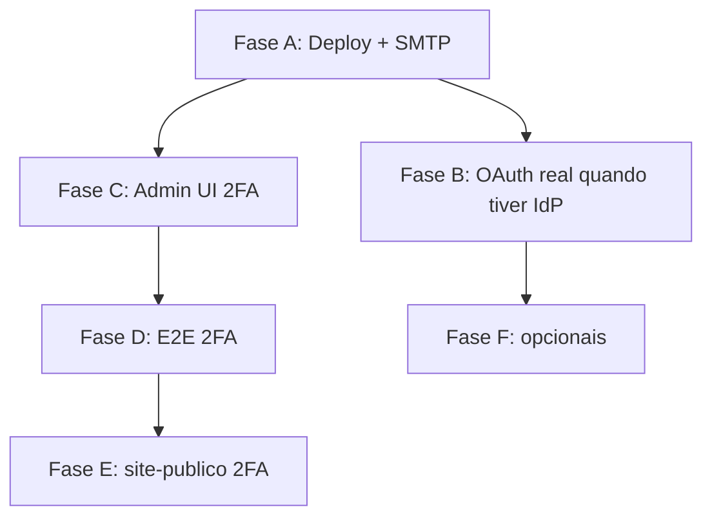

# Auth — roadmap backlog pós-D2 (Fases A–F)

**Data:** 2026-06-22  
**Contexto:** trilha D2.1–D2.10 (API v1, reset, 2FA backend, turismo, site-publico BFF, OAuth mock) concluída no código.  
**Plano mestre:** `AUTH-ALIGNMENT-PLAN.md` · **Deploy:** `AUTH-PRODUCTION-DEPLOY.md`

---

## Estado atual (referência)

| Camada | Forgot/reset | 2FA setup/login | OAuth |
|--------|--------------|-----------------|-------|
| **Backend v1** | ✅ D2.4/D2.8 | ✅ D2.5 `/api/v1/auth/2fa/*` | ✅ D2.9 |
| **Turismo** | ✅ D2.6 | ✅ `TwoFactorAuth.tsx` + step login | — |
| **site-publico** | ✅ D2.7 BFF | ⚠️ redirect OAuth `requires_2fa`; **sem BFF 2FA** | ✅ mock/real |
| **Admin** | — | ❌ **sem UI 2FA** | — |
| **Testes** | ✅ E2E forgot (`auth-v1`) | ⚠️ integration mocked; **sem E2E fluxo completo** | ✅ `test:e2e:auth-oauth-mock` |

Spec: `docs/security/AUTH-V1-2FA-PASSWORD-RESET-SPEC.md` · §8 fora de escopo: SMS, WebAuthn, 2FA obrigatório por role.

---

## Ordem recomendada



| Ordem | Fase | Motivo |
|-------|------|--------|
| 1 | **A** | Go-live sem depender de Google/Facebook |
| 2 | **C** | Backlog explícito; admin precisa de 2FA operacional |
| 3 | **D** | Regressão automatizada do fluxo 2FA |
| 4 | **E** | Paridade site público ↔ turismo |
| 5 | **B** | Quando tiver acesso aos consoles IdP |
| 6 | **F** | Polish / dívida técnica |

---

# Fase A — Produção operacional

**Objetivo:** sistema no ar com auth real (OAuth pode permanecer mock em staging interno).

### A.1 — Servidor e `.env`

1. Clonar repo no servidor; copiar `.env.production.example` → `.env`.
2. Gerar secrets: `openssl rand -hex 32` para `JWT_SECRET`, `OAUTH_BFF_SECRET`, postgres.
3. Ajustar URLs: `NEXT_PUBLIC_SITE_URL`, `PASSWORD_RESET_BASE_URL`, `NEXT_PUBLIC_BACKEND_URL`.
4. `npm run validate:auth-env` com `NODE_ENV=production`.

### A.2 — E-mail reset real (D2.8)

1. Escolher **SMTP/SES** ou **webhook HTTPS** (não `host.docker.internal`).
2. Preencher `SMTP_*` ou `PASSWORD_RESET_EMAIL_WEBHOOK` no backend.
3. Smoke: `/recuperar-senha` → e-mail/webhook → `/redefinir-senha?token=…`.

### A.3 — Deploy Docker

```bash
docker compose -p rsv360 build backend site-publico
docker compose -p rsv360 up -d postgres redis backend site-publico
docker compose -p rsv360 exec backend npm run migrate
```

### A.4 — Smoke automatizado

```bash
npm run test:e2e:auth-v1
npm run test:e2e:auth-oauth-mock   # se OAUTH_DEV_MOCK=true
```

### A.5 — Checklist manual

- [ ] Login e-mail/senha
- [ ] Register
- [ ] Forgot → reset
- [ ] OAuth mock ou real
- [ ] HTTPS + domínio real

**Entregável evidência:** `D2.11-PRODUCTION-SMOKE-RESULT.md`  
**Esforço:** 0,5–1 dia (DNS/SMTP dependentes).

---

# Fase B — OAuth real (passo 4 IdP)

**Guia:** `D2.10-OAUTH-IDP-SETUP-GUIDE.md` (seção passo 4).

1. Google Cloud → OAuth client Web → redirect URI exata.
2. Meta → Facebook Login → Valid OAuth Redirect URIs.
3. `.env`: `GOOGLE_*`, `FACEBOOK_*`, `OAUTH_DEV_MOCK=false`.
4. `docker compose up -d --force-recreate backend site-publico`.
5. Smoke manual `/login` → Google/Facebook.

**Enquanto sem IdP:** manter mock (`D2.10` seção “Modo mock”).

**Esforço:** 2–4 h (configuração).

---

# Fase C — Admin UI 2FA (D2.12)

**Objetivo:** operadores do admin (`:3004`) ativam/desativam 2FA.

**Referência:** `apps/turismo/src/components/auth/TwoFactorAuth.tsx`

### C.1 — Descoberta

- Rota settings (`/settings/security` ou equivalente).
- Padrão visual admin existente.

### C.2 — Client API

`apps/admin/lib/auth/two-factor.ts`:

| Ação | Endpoint v1 |
|------|-------------|
| Setup (QR) | `POST /api/v1/auth/2fa/setup` + Bearer |
| Ativar | `POST /api/v1/auth/2fa/verify-setup` `{ code }` |
| Desativar | `POST /api/v1/auth/2fa/disable` |
| Backup codes | `POST /api/v1/auth/2fa/backup-codes` |

### C.3 — UI settings

1. Card “Autenticação em duas etapas”.
2. Fluxo: desativado → QR + 6 dígitos → ativo (backup codes uma vez).
3. Desativar: senha + TOTP.

### C.4 — Login admin com 2FA

- Resposta `requires_2fa` + `temp_token` → step código.
- `POST /api/v1/auth/2fa/verify` → sessão admin.

### C.5 — Testes

- Manual: setup → logout → login → Authenticator.

**PR sugerido:** `feat(admin): UI 2FA settings + login step (D2.12)`  
**Esforço:** ~2–3 dias.

---

# Fase D — E2E 2FA fluxo completo (D2.13)

**Objetivo:** Playwright cobre setup → login → verify.

### D.1 — Pré-requisitos

- Backend + postgres com migration `0007_create_user_2fa.sql`.
- Usuário seed (`test@local.dev`) ou criar no teste.
- Dev dependency `otplib` (TOTP a partir do secret do setup).

### D.2 — Spec `tests/e2e/auth-v1/auth-v1-2fa.spec.ts`

| # | Cenário |
|---|---------|
| 12 | `POST /2fa/setup` + Bearer → 200 |
| 13 | `POST /2fa/verify-setup` TOTP válido → backup_codes |
| 14 | `POST /login` → `requires_2fa` + `temp_token` |
| 15 | `POST /2fa/verify` TOTP → tokens |
| 16 | `GET /session` → 200 |
| 17 | código inválido → 401 |
| 18 | (opcional) `backup_code` |

- Modo **serial** (como `auth-v1-api.spec.ts`).
- `X-Forwarded-For` único por teste (rate limit).

### D.3 — Script npm

```json
"test:e2e:auth-v1-2fa": "playwright test --config=tests/e2e/playwright.auth-v1.config.ts --grep 2fa"
```

ou config dedicada.

**PR sugerido:** `test(auth): E2E 2FA setup-login-verify (D2.13)`  
**Entregável:** `D2.13-E2E-2FA-RESULT.md`  
**Esforço:** ~1–1,5 dia.

---

# Fase E — site-publico 2FA (D2.14)

**Gap:** turismo tem 2FA; site-publico só forgot/reset BFF (D2.7).

### E.1 — BFF routes

`apps/site-publico/app/api/auth/2fa/`:

- `setup`, `verify-setup`, `verify`, `disable`, `backup-codes`  
- `proxyAuthV1` + Bearer (padrão D2.7).

### E.2 — Login UI

- `app/login`: step `requires_2fa` / query `temp_token` (OAuth já parcial).
- Componente 6 dígitos + backup code.

### E.3 — Perfil / segurança

- `/perfil/seguranca` ou seção em `/perfil`.

### E.4 — Deprecar legado

- `apps/site-publico/lib/two-factor-auth.ts` → só v1 BFF (evitar duas fontes).

**PR sugerido:** `feat(site-publico): BFF 2FA + login step (D2.14)`  
**Esforço:** ~2–3 dias.

---

# Fase F — Opcionais (pós-MVP)

| Item | Descrição | Prioridade |
|------|-----------|------------|
| E2E OAuth real | Playwright + credenciais IdP em CI secrets | Baixa |
| 2FA obrigatório admin | Policy por role (spec §8 futuro) | Baixa |
| SMS / WebAuthn | Fora de escopo v1 | Futuro |
| Guest namespace D3 | Fora de escopo | Futuro |
| Admin forgot-password UI | Se não existir tela reset no admin | Média |
| `package-lock` site-publico no git | Docker reproduzível | Baixa |

---

## Definição de “auth 100% fechado”

- [ ] Fase A — smoke produção documentado
- [ ] Fase B — OAuth real **ou** decisão mock só staging interno
- [ ] Fase C — Admin UI 2FA
- [ ] Fase D — E2E 2FA
- [ ] Fase E — site-publico 2FA (se produto exigir usuário final)

---

## Comandos úteis

```powershell
# Local (mock OAuth)
npm run test:e2e:auth-v1
npm run test:e2e:auth-oauth-mock
npm run validate:auth-env

# Após Fase D
npm run test:e2e:auth-v1-2fa

# Deploy
docker compose -p rsv360 up -d --force-recreate backend site-publico
npm run staging:webhook   # reset local sem SMTP
```

---

## Referências

- `AUTH-ALIGNMENT-PLAN.md`
- `AUTH-PRODUCTION-DEPLOY.md`
- `D2.10-OAUTH-IDP-SETUP-GUIDE.md`
- `D2.5-BACKEND-2FA-RESULT.md` · `D2.6-TURISMO-2FA-RESET-V1-RESULT.md` · `D2.7-SITE-PUBLICO-AUTH-BFF-RESULT.md`
