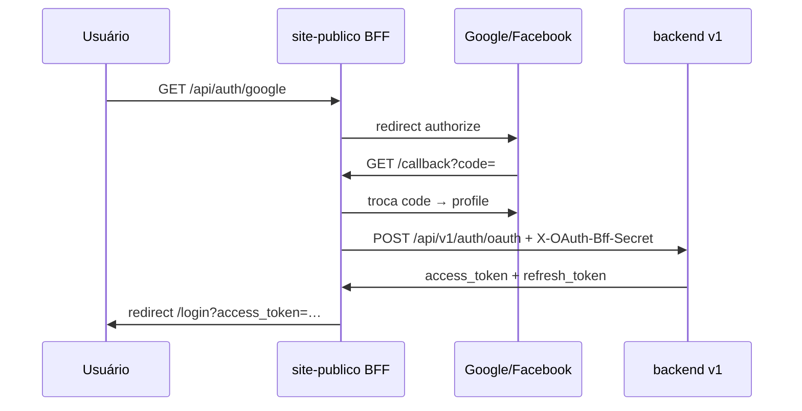

# D2.9 — OAuth social site-publico → backend v1

**Data:** 2026-06-22  
**Escopo:** Google/Facebook no site-publico via BFF; tokens v1 canônicos

## Arquitetura



## Entregue

| Peça | Detalhe |
|------|---------|
| Backend | `POST /api/v1/auth/oauth` — find/create user, issueLoginTokens, 2FA aware |
| BFF | `/api/auth/google|facebook` + callbacks sem DB local |
| Segurança | `OAUTH_BFF_SECRET` (obrigatório prod) |
| Dev | `OAUTH_DEV_MOCK=true` — fluxo mock sem credenciais IdP |
| UI | Login same-origin; persiste access + refresh v1 |

## Env

```env
OAUTH_BFF_SECRET=<shared-secret>
GOOGLE_CLIENT_ID=...
GOOGLE_CLIENT_SECRET=...
FACEBOOK_APP_ID=...
FACEBOOK_APP_SECRET=...
NEXT_PUBLIC_SITE_URL=https://www.reserveiviagens.com.br
# dev only:
OAUTH_DEV_MOCK=true
```

## Testes

```bash
npm test --workspace=backend -- auth-v1-oauth password-reset-email
```

## Referências

- `backend/src/api/v1/auth/oauth.service.js`
- `apps/site-publico/lib/oauth-server.ts`
