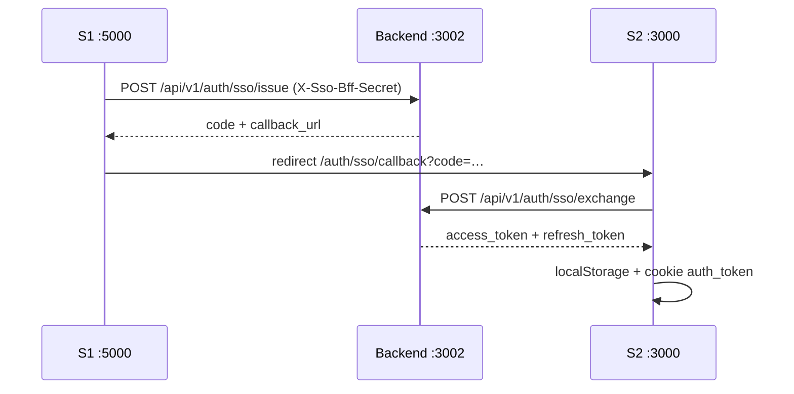

# Fase 4 — SSO S1 (:5000) ↔ S2 (:3000) Marketing Lab

**Data:** 2026-06-24  
**Branch:** `feat/coexistence-fase4-sso`  
**Pré-requisito:** Fase 3 (`RSV360_APP_MODE=marketing-lab`)

---

## Objetivo

Login único entre o site B2C (S1) e o Marketing Lab (S2) via **código one-time** trocado no backend `:3002` — sem compartilhar cookie entre portas diferentes.



---

## Entregas (rsv360)

| Artefato | Descrição |
|----------|-----------|
| `backend/drizzle/0011_auth_sso_codes.sql` | Tabela `auth_sso_codes` |
| `backend/src/api/v1/auth/sso.service.js` | issue + exchange |
| `backend/src/api/v1/auth/routes.js` | `POST /sso/issue`, `/sso/exchange` |
| `apps/site-publico/app/api/auth/sso/*` | BFF exchange + dev-handoff |
| `apps/site-publico/app/auth/sso/callback` | Página de callback |
| `apps/site-publico/components/lab/MarketingLabSsoPanel.tsx` | UI login único |
| `apps/site-publico/lib/sso-config.ts` | URLs e flags |

---

## Variáveis

```env
SSO_BFF_SECRET=…          # ou reutiliza OAUTH_BFF_SECRET
SSO_DEV_MOCK=true         # dev: /api/auth/sso/dev-handoff
MARKETING_LAB_REQUIRE_AUTH=false  # true = middleware exige auth_token no lab
MARKETING_LAB_URL=http://localhost:3000
NEXT_PUBLIC_PRIMARY_SITE_URL=http://localhost:5000
```

---

## Fluxo dev (sem alterar S1)

```powershell
# 1. Migrate
docker compose exec backend npm run migrate

# 2. Simular handoff S1 → S2
start http://localhost:3000/api/auth/sso/dev-handoff?return=/lab

# 3. Ou via login
start "http://localhost:3000/login?sso=1&redirect=/lab"
```

---

## Integração S1 (Crm-RSV-360 — repo separado)

Endpoint sugerido no S1 (`:5000`):

```
GET /api/auth/lab-handoff?return=/lab&lab_url=http://localhost:3000
```

1. Verificar `req.session.userId`
2. Carregar e-mail/nome do usuário
3. `POST http://localhost:3002/api/v1/auth/sso/issue` com header `X-Sso-Bff-Secret`
4. `302` para `callback_url` retornado

**Regra Fase 3:** commits S1 ficam no repo `Crm-RSV-360`; este PR só documenta o contrato.

---

## Critérios de aceite

- [x] Backend emite e troca código SSO (TTL 2 min, uso único)
- [x] S2 callback grava tokens e redireciona para `/lab`
- [x] Dev mock sem S1 (`SSO_DEV_MOCK=true`)
- [x] Painel SSO em `/login` no modo lab
- [ ] S1 `lab-handoff` implementado (repo externo)
- [ ] `MARKETING_LAB_REQUIRE_AUTH=true` em staging/prod

---

## Referências

- `FASE3-MARKETING-LAB-RESULT.md`
- `apps/site-publico/lib/sso-config.ts`
