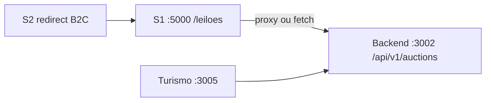

# Fase 5 — API leilões `:3002` (coexistência S1 + S2)

**Data:** 2026-06-25  
**Pré-requisito:** Fase 4 merged (rsv360 PR #33, Crm-RSV-360 PR #10)  
**Branch sugerida:** `feat/fase5-auctions-api`

---

## Objetivo

Centralizar leilões no backend RSV360 (`:3002`) para que S1 (`:5000`) e S2 (`:3000`) consumam a mesma fonte — substituindo dados mock/local do Crm-RSV-360.



---

## Estado atual

| Camada | Situação |
|--------|----------|
| **S1 Crm-RSV-360** | `client/src/pages/leiloes.tsx` — dados mock + WebSocket local |
| **S2 site-publico** | UI em `/leiloes` (modo public); em marketing-lab redireciona → S1 |
| **Backend rsv360** | Referência em `docs/AUDITORIA-MODULO-LEILOES.md`; rotas v1 a implementar/reviver |
| **Turismo** | `leiloesApi.ts` já aponta para `/api/v1/auctions` |

---

## Entregas (rsv360)

### 5.1 — Schema + migration

- Tabelas `auctions`, `bids` (alinhar com `003_create_auctions_tables` ou schema auditado)
- Migration Drizzle + snapshot + journal

### 5.2 — API v1

| Método | Rota | Auth |
|--------|------|------|
| GET | `/api/v1/auctions` | público |
| GET | `/api/v1/auctions/:id` | público |
| POST | `/api/v1/auctions/:id/bids` | Bearer JWT |
| GET | `/api/v1/auctions/:id/bids` | público |

- `service.js` + `routes.js` + registro em `app.js`
- Seed `scripts/seed-auctions.js` para dev

### 5.3 — Smoke + testes

- Integration test CRUD + bid
- `npm run smoke:auctions` ou extensão do marketing-lab smoke

### 5.4 — S1 proxy (Crm-RSV-360 — PR separado)

- `GET /api/leiloes` → proxy `:3002/api/v1/auctions`
- `leiloes.tsx` consumir API real (fallback mock só dev)
- WebSocket: fase 5.1 pode ser polling; WS em 5.2 opcional

---

## Critérios de aceite

- [ ] Backend lista e detalhe leilão ativo
- [ ] Lance autenticado persiste e atualiza `current_price`
- [ ] S1 `/leiloes` mostra dados do `:3002` (não só mock)
- [ ] Smoke local documentado em `FASE5-AUCTIONS-RESULT.md`

---

## Comandos locais (após implementação)

```powershell
cd rsv360
git checkout main && git pull
git checkout -b feat/fase5-auctions-api

docker compose up -d postgres backend
docker compose exec backend npm run migrate
node backend/scripts/seed-auctions.js   # se existir

curl http://127.0.0.1:3002/api/v1/auctions
```

---

## Referências

- `FASE4-SSO-RESULT.md`
- `docs/AUDITORIA-MODULO-LEILOES.md`
- `apps/turismo/src/services/api/leiloesApi.ts`
