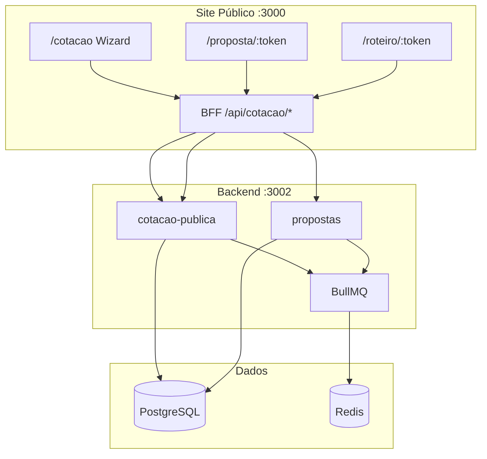

# Wizard de Cotação v2 + Proposta + Roteiro Premium — Fluxo Completo

> **Versão:** jun/2026 · **Stack:** Next.js 15 (`site-publico` :3000) + Backend Fase 1 (`:3002`) + PostgreSQL + Redis/BullMQ  
> **Destino padrão:** Caldas Novas, GO  
> **Repositório:** `apps/site-publico/components/cotacao/wizard/`

---

## 1. Visão geral da jornada do cliente

```
/cotacao (Wizard 8 passos)
    │
    ▼ POST /api/cotacao/gerar-proposta
/proposta/:token  ← "corredor comercial" (aceitar/recusar, chat, countdown)
    │
    ▼ Aceite (status → accepted)
/roteiro/:token   ← Roteiro Premium Cinematográfico (pós-conversão)
```

| Fase | Rota | O que o cliente vê |
|------|------|-------------------|
| Montagem da viagem | `http://localhost:3000/cotacao` | Wizard interativo 8 passos |
| Negociação / urgência | `http://localhost:3000/proposta/rt-…` | Proposta comercial + chat HITL |
| Experiência premium | `http://localhost:3000/roteiro/rt-…` | Hero vídeo, timeline, wallet, footer |

> **Nota coexistência:** em modo `marketing-lab`, rotas `/cotacao`, `/proposta` e `/roteiro` ficam no **S2 (:3000)**. O site B2C legado continua em **S1 (:5000)**.

---

## 2. Stack técnica

### Frontend (`apps/site-publico`)

| Camada | Tecnologia |
|--------|------------|
| Framework | Next.js App Router |
| UI | React, Tailwind, shadcn/ui (`Card`, `Button`, `DateRangePicker`) |
| Estado wizard | `WizardContext` + `localStorage` (rascunho 7 dias) |
| Animações roteiro | Framer Motion (`CinematicItinerary`) |
| Tempo real | Socket.IO (`proposta:expirada`, chat) |
| BFF | `app/api/cotacao/*`, `app/api/propostas/*` |

### Backend (`server/modules` + `backend`)

| Módulo | Responsabilidade |
|--------|------------------|
| `cotacao-publica` | Disponibilidade, gerar proposta, aceitar, roteiro |
| `propostas` | CRUD, chat HITL, expiração, aviso proativo |
| `fornecedores-hub` | Orquestração de disponibilidade real (quando configurado) |
| BullMQ | Jobs: expirar proposta, aviso 2h antes, objeção preço |

### APIs principais

| Método | Rota BFF (S2) | Upstream (backend) |
|--------|---------------|-------------------|
| GET | `/api/cotacao/disponibilidade` | Hub + catálogo CMS |
| POST | `/api/cotacao/gerar-proposta` | `POST /api/v1/cotacao-publica/gerar-proposta` |
| GET | `/api/cotacao/proposta/:token/validade` | `GET …/proposta/:token/validade` |
| POST | `/api/cotacao/proposta/:token/aceitar` | `POST …/proposta/:token/aceitar` |
| GET | `/api/cotacao/roteiro/:token` | `GET …/roteiro/:token` |
| GET/POST | `/api/propostas/:id/*` | `GET/POST /api/v1/propostas/:id/*` |

---

## 3. O que o cliente preenche — passo a passo

O wizard tem **8 passos** (índices 0–7). Nomes exibidos na barra de progresso:

| # | Nome na UI | Componente | Obrigatório? |
|---|------------|------------|--------------|
| 1 | Datas e hóspedes | `WizardStepDates` | Sim |
| 2 | Hotel | `WizardStepHotel` | Sim |
| 3 | Diversão | `WizardStepActivities` | Não* |
| 4 | Atrações | `WizardStepAttractions` | Não |
| 5 | Café da manhã | `WizardStepBreakfast` | Sim |
| 6 | Kit acomodação | `WizardStepAccommodation` | Sim |
| 7 | Seu Roteiro | `WizardStepItinerary` | Aprovação |
| 8 | Contato e pagamento | `WizardStepReview` | Sim |

\* Passo 3 pode ser **pulado** via atalho **"Apenas hotel"** (vai direto ao passo 5).

---

### Passo 1 — Datas e hóspedes

**Campos preenchidos pelo cliente:**

| Campo | Tipo | Validação |
|-------|------|-----------|
| Check-in / Check-out | `DateRangePicker` | Check-out > check-in |
| Adultos | número (1–20) | Mínimo 1 |
| Crianças | número (0–20) | Opcional (default 0) |

**Automático (não editável pelo cliente):**
- **Perfil de viagem** inferido: `casal` | `familia` | `aventura`  
  - Regra: 2 adultos sem crianças → casal; com crianças → família; etc.

**Ao avançar:**
- Chama `GET /api/cotacao/disponibilidade?checkIn&checkOut&adults&children`
- Carrega catálogo dinâmico: hotéis, ingressos (parques), atrações
- Fallback: CMS estático se API falhar

**Persistência:** rascunho salvo em `localStorage` (`rsv360-cotacao-wizard-v2`).

---

### Passo 2 — Hotel

**Campos / ações:**

| Ação | Detalhe |
|------|---------|
| Selecionar **1 hotel** | Cards com foto, preço × noites, local, vídeo opcional |
| **Upgrade Suíte Master** | Toggle opcional (+ R$ 80/noite) |
| **"Apenas hotel"** | Atalho: pula parques/atrações (passos 3–4), vai ao café da manhã |

**Não existe hoje:**
- Seleção de **categoria de quarto** (Standard/Deluxe/Luxo) como passo separado
- Escolha de **tipo de cama** ou **ocupação por quarto**
- O único upgrade de quarto é o **Suíte Master** (add-on fixo)

**Preço hotel:** `preço diária × noites` (+ upgrade se marcado)

---

### Passo 3 — Diversão (Parques e ingressos)

**Campos / ações:**

| Ação | Detalhe |
|------|---------|
| Selecionar **0 ou mais ingressos** | Multi-seleção (Hot Park, etc.) |
| Ajustar datas | `DateRangePicker` compacto (recarrega disponibilidade) |

**Preço:** `preço ingresso × total de hóspedes (adultos + crianças)`

**Opcional:** cliente pode avançar sem selecionar nenhum ingresso.

---

### Passo 4 — Atrações locais

**Campos / ações:**

| Ação | Detalhe |
|------|---------|
| **Seguro Assistência Local** | Toggle opcional (R$ 15/pessoa) — acidentes leves, insolação, emergências em parques |
| Selecionar **0 ou mais atrações** | Ex.: Parque Estadual, Feira do Luar (podem ser grátis) |

**Não existe hoje:**
- **Transfer** aeroporto/hotel
- **Transporte entre parques**
- **Experiências guiadas** como categoria separada (entram como itens de catálogo `attraction`)

**Preço atrações:** `preço × hóspedes` (R$ 0 = "Incluir grátis")

---

### Passo 5 — Café da manhã

**Campos:** escolher **1 opção** (obrigatório)

| ID | Opção | Preço/pessoa/dia |
|----|-------|------------------|
| `continental` | Café Continental | R$ 25 |
| `executivo` | Café Executivo | R$ 45 |
| `completo` | Café Completo | R$ 65 |

**Preço:** `preço × hóspedes × noites`  
Ordem sugerida por perfil (`casal`, `familia`, `aventura`).

---

### Passo 6 — Kit acomodação

**Modos (toggle):**

#### A) Kits prontos (default)
| Kit | Conteúdo resumido | Preço fixo/estadia | Capacidade |
|-----|-------------------|-------------------|------------|
| `kit-casal` | Lençol casal, fronhas, toalhas, cobertor | R$ 70 | até 2 |
| `kit-familia` | Lençóis/fronhas/toalhas família | R$ 120 | até 6 |
| `kit-individual` | Kit solteiro | R$ 40 | 1 |

#### B) Itens avulsos
Multi-seleção: Lençol, Fronha, Toalha, Cobertor, Travesseiro extra (preços unitários).

**Validação:** kit ou ao menos 1 item avulso.  
**Alerta:** se hóspedes > capacidade do kit selecionado.

> Isso é **enxoval/amenities**, não seleção de tipo de quarto no hotel.

---

### Passo 7 — Seu Roteiro (preview no wizard)

**O cliente não preenche campos novos** — visualiza o roteiro montado automaticamente.

**Componente:** `RoteiroPreviewShell` (modo `wizard`)  
**Fonte:** `montarRoteiroPreview(state, catalog)` — timeline dia a dia:
- Dia 1: chegada + hotel
- Dias seguintes: parques/atrações rotacionados
- Mood tags: Relaxamento, Diversão, Natureza

**Ação:** botão **"Aprovar Roteiro"** → avança ao passo 8.

> Este preview é **diferente** do Roteiro Premium Cinematográfico (`/roteiro/:token`), que só libera após aceite.

---

### Passo 8 — Contato e pagamento

**Campos preenchidos:**

| Campo | Obrigatório | Observação |
|-------|-------------|------------|
| Nome | Sim | |
| WhatsApp | Sim | Canal principal pós-proposta |
| E-mail | Não | Cópia da proposta |
| Pedido especial | Não | Aniversário, restrição alimentar, horário chegada… |
| Forma de pagamento | Sim | **Pix** ou **Cartão** (preferência; sem cobrança automática) |

**Resumo exibido:** `WizardClosingSummary` — todos os itens escolhidos com vouchers persuasivos.

**Submit:** **"Confirmar e gerar proposta"**
- `POST /api/cotacao/gerar-proposta` com payload completo do `WizardState`
- Redireciona para `/proposta/rt-XXXXXXXX`

---

## 4. Fórmula de preço (running total)

Visível nos passos 2–6 (`WizardStickyTotal`):

```
Total =
  Hotel (diária × noites)
  + Upgrade Suíte (R$ 80 × noites, se marcado)
  + Σ Ingressos (preço × hóspedes)
  + Σ Atrações (preço × hóspedes)
  + Café (preço/dia × hóspedes × noites)
  + Kit acomodação OU itens avulsos
  + Seguro (R$ 15 × hóspedes, se marcado)
```

---

## 5. Pós-wizard: Proposta comercial (`/proposta/:token`)

### O que o backend faz ao gerar

1. Cria **orçamento** + itens (`buildOrcamentoItens`)
2. Cria **proposta** (`createFromOrcamento`)
3. Publica: `token_publico`, `status=sent`, `valido_ate`
4. Monta `conteudo`: `dailySchedule`, `inclusions`, `media`
5. Agenda BullMQ: expiração + aviso 2h antes
6. Notifica hot lead (WhatsApp interno, se configurado)

### O que o cliente vê na proposta

| Bloco | Conteúdo |
|-------|----------|
| Cabeçalho | Título, nome, status, valor, validade |
| Itens incluídos | Lista do orçamento |
| Comparativo mercado | Revelado após 3 visualizações (job objeção) |
| Aceitar / Recusar | Se status aberto |
| Chat consultor | Mensagens + "Falar com humano" (HITL) |

### Aceite → Roteiro Premium

```
POST /api/cotacao/proposta/:token/aceitar
  → status: accepted
  → proximoDestino: /roteiro/:token
  → redirect automático (server + client)
```

### Guardas de expiração

- `GET /api/cotacao/proposta/:token/validade` → `restanteMs`, `expirada`
- Socket `proposta:expirada` atualiza UI em tempo real
- Proposta expirada: bloqueio 403 no aceite; banner no roteiro

---

## 6. Roteiro Premium Cinematográfico (`/roteiro/:token`)

**Gating server-side:** apenas `status ∈ {accepted, paid}`  
Caso contrário → redirect `/proposta/:token`

### Componentes (`components/roteiro/`)

| Componente | Função |
|------------|--------|
| `CinematicHero` | Vídeo/poster hero fullscreen |
| `StickyNav` | Navegação fixa entre seções |
| `CountdownTimer` | Timer `restanteMs` (fonte: servidor) |
| `StorytellingTimeline` | Timeline zig-zag dia a dia |
| `DigitalWallet` | Carteira digital / vouchers |
| `ActionFooter` | Total, WhatsApp, renovar proposta |
| `ExpiradaBanner` | Bloqueio visual se expirou |

### Hooks

- `useRoteiroValidade(token)` — polling validade
- `usePropostaExpiradaSocket` — evento tempo real

### Diferença Passo 7 vs Roteiro Premium

| | Passo 7 (Wizard) | `/roteiro/:token` |
|--|------------------|-------------------|
| Quando | Antes da proposta | Após aceite |
| Visual | Preview claro (`RoteiroPreviewShell`) | Dark cinematic (`CinematicItinerary`) |
| Vídeo hero | Opcional nos cards | Hero fullscreen |
| Countdown | Não | Sim |
| Chat | Não | Footer WhatsApp |
| Gating | Aberto | Server-side accepted/paid |

---

## 7. O que NÃO está no wizard hoje

| Funcionalidade | Status |
|----------------|--------|
| Transfer aeroporto/hotel | ❌ Não implementado |
| Categoria de quarto (Standard/Deluxe…) | ❌ Apenas upgrade Suíte Master |
| Seleção de voo | ❌ |
| Número de quartos | ❌ (1 hotel implícito) |
| Dados documento/CPF | ❌ (só nome, WhatsApp, e-mail opcional) |
| Pagamento online imediato | ❌ (preferência Pix/Cartão; cobrança posterior) |
| Multi-destino | ❌ (Caldas Novas fixo no fluxo atual) |

---

## 8. Persistência e analytics

### localStorage

| Chave | Conteúdo |
|-------|----------|
| `rsv360-cotacao-wizard-v2` | Estado completo + passo |
| `rsv360-cotacao-wizard-v2-step` | Índice do passo |
| `rsv360-cotacao-wizard-v2-catalog` | Catálogo da última disponibilidade |

TTL rascunho: **7 dias**

### Eventos (`cotacao-analytics`)

- `cotacao_step_viewed` / `cotacao_step_completed` / `cotacao_step_abandoned`
- `cotacao_item_selected` (hotel, ticket, attraction, breakfast, kit…)
- `cotacao_roteiro_preview_approved`
- `cotacao_proposta_generated`

---

## 9. Diagrama de arquitetura



---

## 10. Checklist de teste manual

- [ ] Completar wizard com perfil casal (2 adultos)
- [ ] Testar atalho "Apenas hotel"
- [ ] Verificar total sticky nos passos 2–6
- [ ] Aprovar roteiro no passo 7
- [ ] Gerar proposta no passo 8
- [ ] Aceitar em `/proposta/:token` → redirect `/roteiro/:token`
- [ ] Confirmar hero, timeline, countdown e footer
- [ ] Simular expiração (SQL + worker) e ver banner

---

*Documento gerado a partir do código em `apps/site-publico/components/cotacao/wizard/` e módulos `server/modules/cotacao-publica` + `propostas`.*
