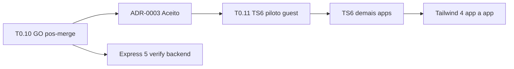

# ADR-0003: Fase E — stack residual (Trilha 0)

**Status:** Aceito  
**Data:** 2026-06-12  
**Merge:** PR **#297** @ `f7186aa95` (2026-06-12)  
**Worktree:** `C:\Users\RSV 360\Documents\s2-fase-e-clean` — branch `chore/trilha-0-t0.11-typescript6-guest`  
**Base:** `main` @ `f7186aa95` (pós-merge PR #297 — ADR-0003)  
**Supersede:** nenhum (complementa [ADR-0002](./ADR-0002-T0.2-STACK-ALVO-MONOREPO.md) §Fase E)  
**Referência:** PLANO-MESTRE-v3-CONSOLIDADO §2 (repo integração)

---

## Contexto

Fases **A–D** da Trilha 0 (ADR-0002) estão **GO / GO condicional**:

| Fase | Entrega | Status |
|------|---------|--------|
| A | React 19 piloto guest | GO |
| B | React 19 site-publico | GO condicional |
| C | Node 24 Docker/CI | GO |
| D | Next 16 app a app | GO condicional |
| T0.10 | Docker admin/guest pós-Next 16 | **GO pós-merge** (#296) |

**Pré-requisito obrigatório desta ADR:** [T0.10-GUEST-ADMIN-DOCKER-STAB.md](./T0.10-GUEST-ADMIN-DOCKER-STAB.md) = **GO pós-merge**. Sem T0.10 GO, **Fase E = NOGO**.

**Soak pós-Next 16:** GO condicional (encerrado — não reabrir).

### Estado atual (workspaces canônicos @ `0b900d8c2`)

| Camada | Atual | Alvo Fase E |
|--------|-------|-------------|
| TypeScript | **5.x** (5.0–5.9 por workspace) | **6.x** |
| Tailwind CSS | **3.3–3.4** | **4.x** |
| Express (backend canônico) | **^5.2.1** | verificar / documentar (já 5.x) |
| Express (legado `apps/turismo/pages/**`) | 4.x | **fora de escopo** T0.1 |

---

## Decisão

Executar **Fase E** em sub-fases isoladas, **um major por PR**, espelhando o piloto guest da Fase A:

| Sub-fase | ID | Escopo | Ordem |
|----------|-----|--------|-------|
| **E1** | T0.11 | TypeScript **6.x** piloto `apps/guest` (+ `packages/shared` se necessário) | **1º** |
| **E2** | T0.12+ | TypeScript 6 — demais apps | após E1 GO |
| **E3** | T0.13+ | Tailwind **4.x** app a app | após E2 estável |
| **E4** | T0.14 | Express 5 — auditoria backend canônico | paralelo baixo risco |

**Não incluído nesta ADR (implementação):** auth, tenant, financeiro, S1, site-publico/turismo/backend na E1.

---

## Hard stops (NOGO imediato)

| # | Condição |
|---|----------|
| H1 | T0.10 não GO pós-merge |
| H2 | `rsv360-admin` ou `rsv360-guest` **unhealthy** ou `:3004`/`:3006` ≠ 200 |
| H3 | API P0 ≠ 8/8 após mudança de runtime |
| H4 | Sem PR dedicado + evidência TSV |
| H5 | Combinar TS6 + Tailwind 4 no mesmo PR |
| H6 | Executar em worktree sujo (`s2-pr232-validate` com drift) — usar worktree limpo |

---

## Gates por sub-fase (herda ADR-0002 G-A1–G-A8)

Cada sub-fase só promove **GO** com:

| # | Critério |
|---|----------|
| G-A1 | PR dedicado + review |
| G-A2 | `npm run build` do escopo — exit 0 |
| G-A3 | `npm run type-check` — exit 0 |
| G-A4 | `npm run lint` — exit 0 ou débito pré-existente documentado |
| G-A5 | Smoke HTTP 200 nas portas afetadas |
| G-A6 | API P0 8/8 (`run-api-p0-round1.ps1`) |
| G-A7 | Log TSV em `docs/evidence/trilha-0/logs/` |
| G-A8 | Rollback tag ou commit baseline identificado |

**E1 (T0.11) adicional:** `docker compose -p rsv360 up -d --build guest` → `:3006` = 200, guest **healthy**; admin permanece estável (T0.10).

---

## Ordem de execução recomendada

1. **Aprovar ADR-0003** (este documento) — status `Aceito`.
2. **T0.11** — implementação TS6 piloto guest (branch isolada; **não iniciar** antes da aprovação).
3. Tailwind 4 e Express verify — somente após E1/E2 GO.

---

## Worktree e isolamento

| Worktree | Uso |
|----------|-----|
| `s2-fase-e-clean` | Fase E / ADR-0003 / T0.11+ (limpo @ `origin/main`) |
| `s2-pr232-validate` | **Não usar** para Fase E até higienizar (stash/drift local) |

**Proibido:** `git reset`, `git restore`, `git clean` no worktree sujo para “forçar” Fase E.

---

## Consequências

### Positivas

- Fecha gaps PLANO-MESTRE §2 residual sem reabrir soak.
- Piloto guest limita blast radius (mesmo padrão T0.3 / T0.6).
- Worktree limpo evita contaminar PR com 22 logs locais ou conflitos de stash.

### Riscos

| Risco | Mitigação |
|-------|-----------|
| TS6 breaking changes em `apps/guest` | Piloto isolado; rollback por tag |
| Tailwind 4 config migration | Sub-fase E3 app a app |
| Regressão Docker guest | Rebuild guest only; manter `next build --webpack` (T0.10) |

---

## Aprovação

| Papel | Nome | Data | Decisão |
|-------|------|------|---------|
| Tech lead / master_owner | Operador RSV360 (merge #297) | 2026-06-12 | ☑ Aprovado |
| Operador S2 | Auto (gates documentais) | 2026-06-12 | ☑ Aprovado |

Após aprovação: alterar **Status** para `Aceito` e atualizar [TRILHA-0-CHECKLIST.md](./TRILHA-0-CHECKLIST.md).

---

## Referências

- [ADR-0002-T0.2-STACK-ALVO-MONOREPO.md](./ADR-0002-T0.2-STACK-ALVO-MONOREPO.md)
- [T0.10-GUEST-ADMIN-DOCKER-STAB.md](./T0.10-GUEST-ADMIN-DOCKER-STAB.md)
- [T0.11-TYPESCRIPT6-GUEST-PLAN.md](./T0.11-TYPESCRIPT6-GUEST-PLAN.md)
- PR #296 (T0.10 merge)
